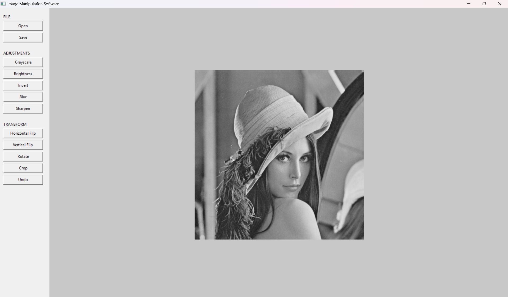
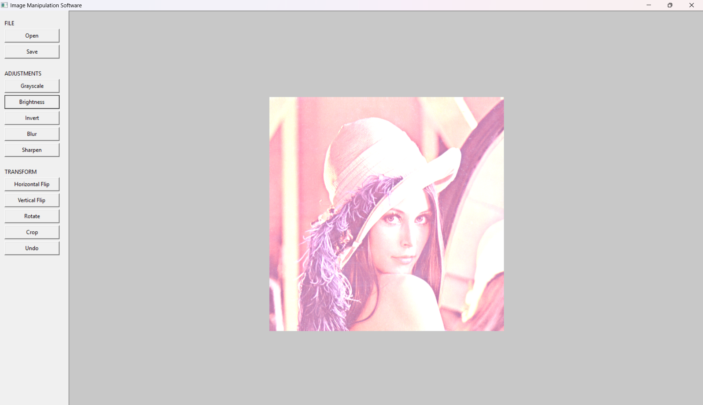
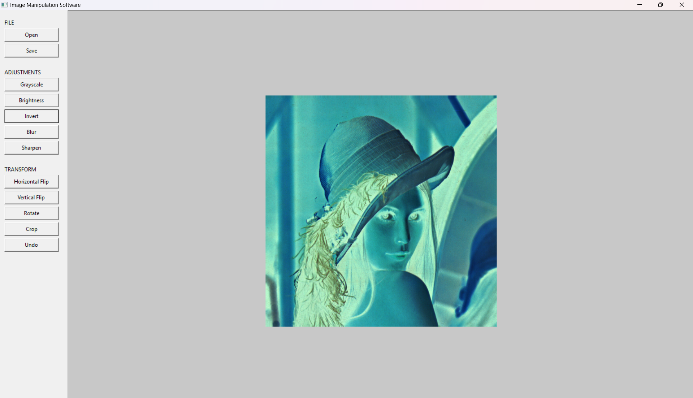
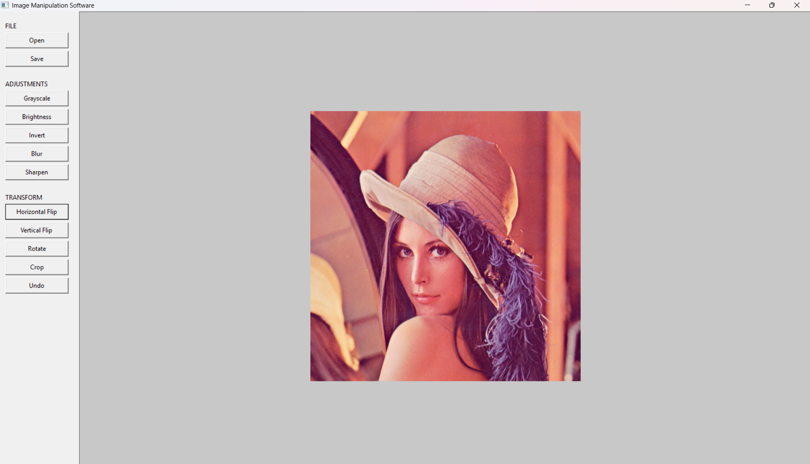
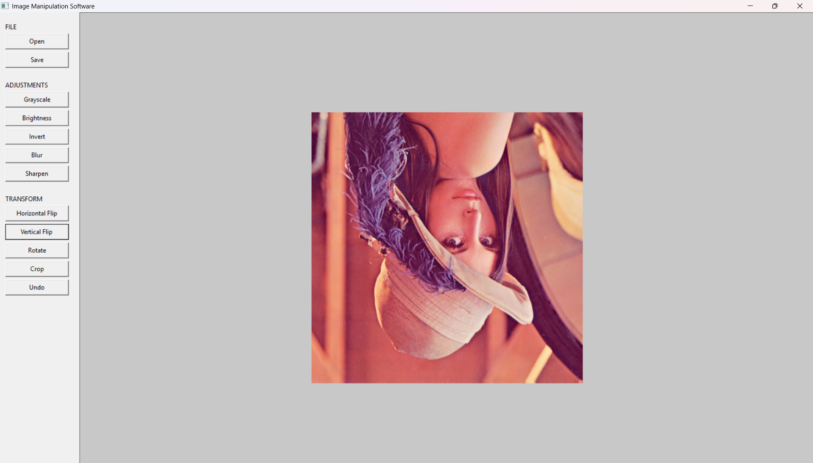
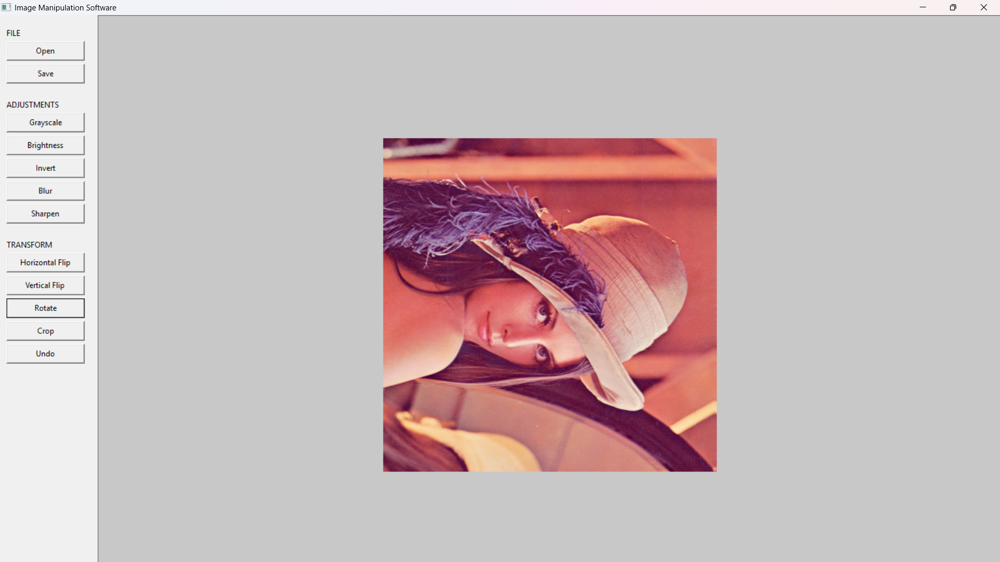
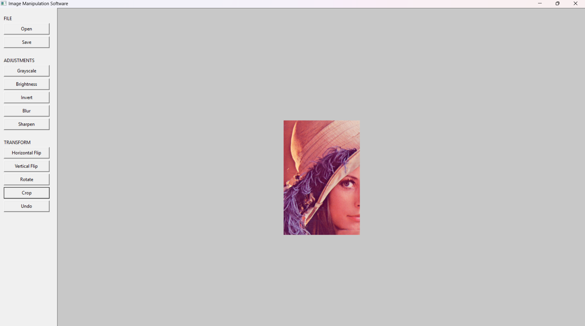
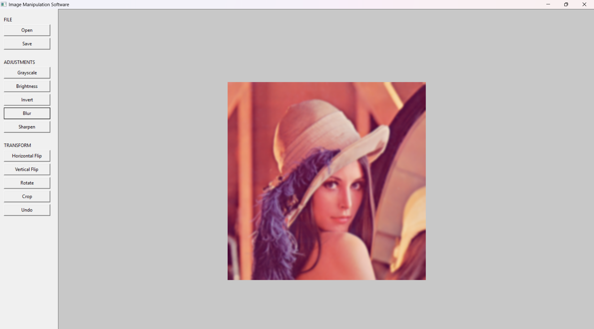
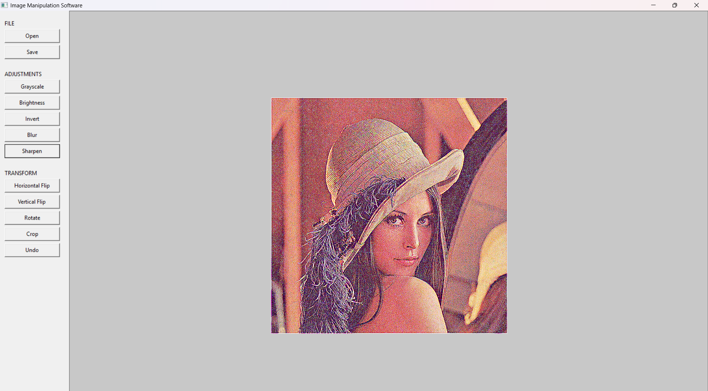
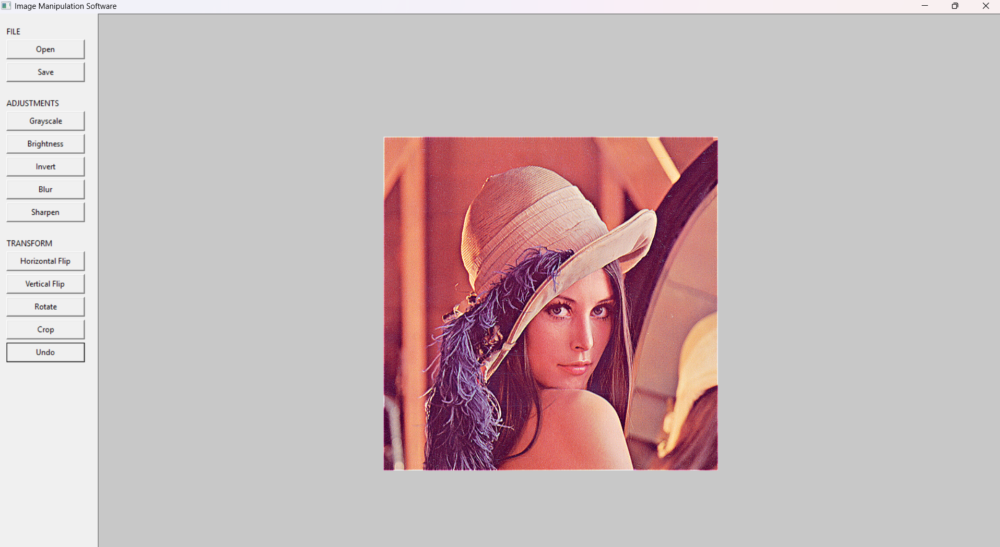

# 🖼️ Image Manipulation Software in C

> A lightweight desktop image-editing application developed in C using the IUP GUI toolkit.

---

## 📌 Overview

**Image Manipulation Software** is a simple desktop application designed to perform
basic image-processing operations on **24-bit uncompressed BMP images**.

The project provides an easy-to-use graphical interface where users can load,
edit, preview, and save images using different image-manipulation tools.

---

## ✨ Features

The application supports the following operations:

| Feature | Description |
|---|---|
| 📂 Open | Open a 24-bit uncompressed BMP image |
| 💾 Save | Save the edited image as a BMP file |
| ⚫ Grayscale | Convert an image into grayscale |
| ☀️ Brightness | Adjust the overall brightness |
| 🎨 Invert | Invert the colors of an image |
| ↔️ Horizontal Flip | Flip the image horizontally |
| ↕️ Vertical Flip | Flip the image vertically |
| 🔄 Rotate | Rotate the image |
| ✂️ Crop | Crop a selected area of the image |
| 🌫️ Blur | Apply a blur effect |
| ✨ Sharpen | Enhance image details |
| ↩️ Undo | Revert the most recent modification |
| ℹ️ Image Information | Display image information |
| ❌ Exit | Close the application |

---

## 🖥️ User Interface

The application uses a compact graphical interface built with the **IUP GUI
toolkit**.

The main interface provides quick access to the major image-processing commands,
while the edited image is displayed directly inside the application window.

<p align="center">
  
</p>

---

## 🎨 Image Processing Showcase

The following examples demonstrate the image-processing operations
implemented in the project.

### 01 — ⚫ Grayscale

Converts the original image from its colors into grayscale.

<p align="center">
  
</p>

---

### 02 — ☀️ Brightness

Changes the overall brightness of the image.

<p align="center">
  
</p>

---

### 03 — 🎨 Invert Colors

Reverses the colors of the image to create a negative-like effect.

<p align="center">
  
</p>

---

### 04 — ↔️ Horizontal Flip

Flips the image from left to right.

<p align="center">
  
</p>

---

### 05 — ↕️ Vertical Flip

Flips the image from top to bottom.

<p align="center">
  
</p>

---

### 06 — 🔄 Rotate

Rotates the image according to the selected rotation option.

<p align="center">
  
</p>

---

### 07 — ✂️ Crop

Crops a selected area of the image and removes the unwanted parts.

<p align="center">
  
</p>

---

### 08 — 🌫️ Blur

Applies a blur effect to soften the details of the image.

<p align="center">
  
</p>

---

### 09 — ✨ Sharpen

Enhances image details and makes the image appear sharper.

<p align="center">
  
</p>

---

### 10 — ↩️ Undo

Reverts the most recent image modification and restores the previous state.

<p align="center">
  
</p>

---

## 📸 Screenshots & Demonstration

The screenshots above demonstrate the application's graphical interface
and different stages of image processing.

Each operation is applied directly to the loaded image, and the result
can be viewed through the application interface.

---

## 🧩 Project Structure

```text
Image-Manipulation-Software/
│
├── include/
│   ├── bmp.h
│   ├── gui.h
│   ├── image.h
│   └── operations.h
│
├── src/
│   ├── bmp.c
│   ├── gui.c
│   ├── image.c
│   ├── main.c
│   └── operations.c
│
├── third_party/
│   └── iup/
│
└── README.md
```

---

## ⚙️ Requirements

### Windows

- GCC / MinGW-w64
- IUP GUI toolkit
- IUP Draw
- Required Windows system libraries for IUP

### Linux

- GCC
- Linux-compatible IUP installation
- IUP Draw
- Required IUP dependencies

---


## 💻 Technologies Used

- **C Programming Language**
- **IUP GUI Toolkit**
- **BMP Image Format**
- **GCC / MinGW-w64**
  


## 📝 Notes

- The application works with **24-bit uncompressed BMP images**.
- Image-processing algorithms are implemented in **C**.
- The graphical interface is developed using the **IUP GUI toolkit**.
- The project is designed as an educational image-processing application.

---

## 🎯 Project Objective

The main objective of this project is to develop a practical understanding of:

- C programming
- File handling
- Dynamic memory management
- Image representation and manipulation
- Basic image-processing algorithms
- GUI development using IUP
- Software project organization

---

## 👩‍💻 Project

**Image Manipulation Software in C**

Developed as a C programming project using the **IUP GUI toolkit**.
